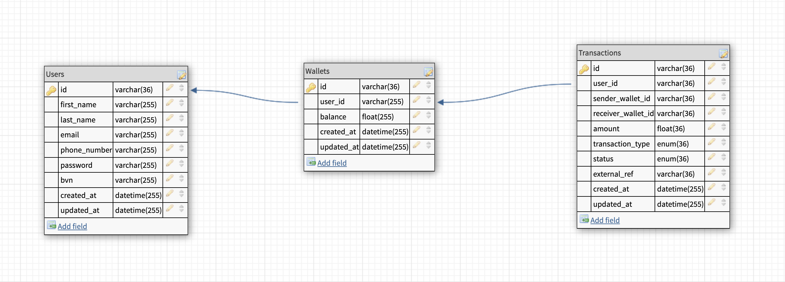

# **CREDIT WALLET LENDSQR - TYPESCRIPT - NODEJS - MYSQL DATABASE - KNEXJS ORM**

---
## PROJECT IMPLEMENTATION SUMMARY

Project can create a user who can create a wallet that can receive and send money. Project can also crosscheck blacklisted users via Adjutor APIs.


---
## SETUP

- Install npm with command below:
```
npm i
```

- Run `npm run dev` in terminal. Service starts on port 5002

---
## BUILD PROCESS

- Ignored authentication as instructed. Else, use logged in user to create wallet and trannsactions

---

## EXTRAS



